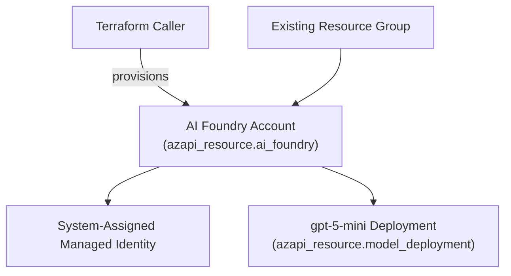

# Azure AI Foundry Account Only (Terraform)

This Terraform configuration deploys an Azure AI Foundry account (`Microsoft.CognitiveServices/accounts` with `kind = AIServices`) and, by default, a single `gpt-5-mini` model deployment inside that account. It does not create projects, connections, private endpoints, virtual networks, or any supporting services.

## Prerequisites

- Terraform 1.6.0 or later.
- Azure CLI authenticated to the target subscription (`az login`) or another supported `azurerm` authentication flow.
- An existing resource group where the AI Foundry account will be created.

## Configuration

Copy `terraform.tfvars.example` to `terraform.tfvars` (or provide another `-var-file`) and update the inputs:

- `resource_group_name`: Resource group that will host the AI Foundry account.
- `account_base_name`: Base string used for the account name; Terraform appends a 4-character suffix for uniqueness.
- `location`: Azure region for the deployment. Must be one of the regions enumerated in `variables.tf`.
- `public_network_access`: Defaults to `Enabled`. Set to `Disabled` only if you plan to add private connectivity outside this template.
- `disable_local_auth`: Optional hardening flag for disabling API-key style auth.
- `allow_project_management`: Keeps the account ready for future project creation without creating a project now.
- `custom_subdomain_name`: Optional override for the account subdomain. Leave empty to reuse the generated account name.
- `deploy_model`: Defaults to `true`. Set to `false` if you want the original account-only behavior.
- `model_deployment_name`, `model_version`, `model_sku_name`, `model_capacity`: Control the default `gpt-5-mini` deployment created in the account.

## Deploy

```bash
terraform init
terraform plan -var-file="terraform.tfvars"
terraform apply -var-file="terraform.tfvars"
```

## Deployed resources

- Azure AI Foundry account (`AIServices`) with SKU `S0`.
- System-assigned managed identity on the account.
- Default `gpt-5-mini` model deployment using version `2025-08-07`, `GlobalStandard` SKU, and capacity `10` when `deploy_model` is `true`.

## Resource Diagram



## Outputs

After `terraform apply`, Terraform emits:

- `account_id`: Resource ID of the AI Foundry account.
- `account_name`: Name of the AI Foundry account.
- `account_endpoint`: Endpoint URI for the AI Foundry account.
- `managed_identity_principal_id`: Principal ID of the system-assigned managed identity.
- `model_deployment_id`: Resource ID of the `gpt-5-mini` deployment when `deploy_model` is `true`.
- `model_deployment_name`: Deployment name when `deploy_model` is `true`.

## Cleanup

Run `terraform destroy -var-file="terraform.tfvars"` to delete the AI Foundry account created by this configuration. The referenced resource group remains untouched.
