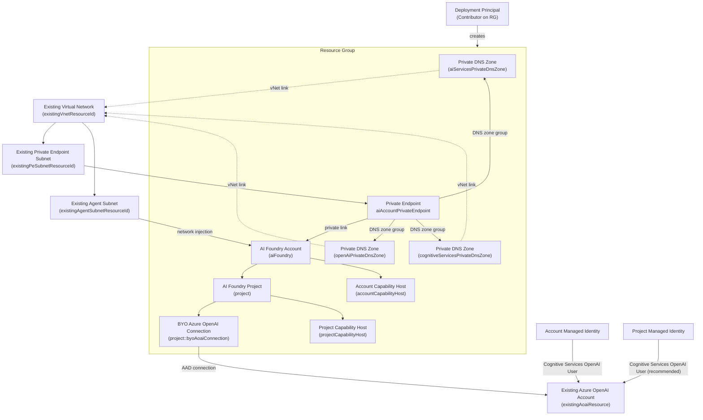

# BYO Azure OpenAI AI Foundry Deployment (Existing VNet)

This directory contains a Bicep template (`main.bicep`) as well as an equivalent Terraform configuration (`terraform/`) that deploys an Azure AI Foundry account with private networking while reusing an existing virtual network, private endpoint subnet, and dedicated agent subnet. The deployment links the account to an existing Azure OpenAI resource through a project connection and configures capability hosts so the project can use that connection.

## What the template deploys
- **AI Foundry account** (`Microsoft.CognitiveServices/accounts`) with `AIServices` kind, system-assigned identity, and public network access disabled.
- **Private endpoint** to the AI Foundry account plus private DNS zones (`privatelink.services.ai.azure.com`, `privatelink.openai.azure.com`, `privatelink.cognitiveservices.azure.com`) linked to your existing VNet.
- **Agent subnet injection** that points the Foundry account at your existing agent subnet for Standard Agents.
- **Project** inside the Foundry account with a BYO Azure OpenAI connection (`connections@2025-04-01-preview`).
- **Capability hosts** at both account and project scope so the project can use the BYO connection.
- **Sample model deployment** (`gpt-4o-mini`) inside the AI Foundry account for validation.

## Required inputs
Collect the following resource IDs:
- Existing virtual network: `/subscriptions/<sub>/resourceGroups/<rg>/providers/Microsoft.Network/virtualNetworks/<vnet>`
- Subnet dedicated to Private Link endpoints: `/subscriptions/<sub>/resourceGroups/<rg>/providers/Microsoft.Network/virtualNetworks/<vnet>/subnets/<subnet>`
- Subnet dedicated to agent workloads: `/subscriptions/<sub>/resourceGroups/<rg>/providers/Microsoft.Network/virtualNetworks/<vnet>/subnets/<agent-subnet>`
- Existing Azure OpenAI account: `/subscriptions/<sub>/resourceGroups/<rg>/providers/Microsoft.CognitiveServices/accounts/<aoai>`

Ensure the Private Link subnet has network policies disabled before deployment, and that the agent subnet meets your network/security requirements for Standard Agents.

## Deploy
1. Create or select a resource group in a supported region:
   ```bash
   az group create --name <rg-name> --location <region>
   ```
2. Deploy the template, providing the resource IDs collected above. You can edit `main.parameters.json` or pass values inline:
   ```bash
   az deployment group create \
     --resource-group <rg-name> \
     --template-file main.bicep \
     --parameters \
       existingVnetResourceId="/subscriptions/<...>/virtualNetworks/<...>" \
       existingPeSubnetResourceId="/subscriptions/<...>/subnets/<...>" \
       existingAgentSubnetResourceId="/subscriptions/<...>/subnets/<agent-subnet>" \
       existingAoaiResourceId="/subscriptions/<...>/accounts/<...>"
   ```

## Terraform
The Terraform project under `terraform/` provisions the same resources using the `azurerm` and `azapi` providers.

1. Copy `terraform/terraform.tfvars.example` to `terraform.tfvars` (or provide variables inline). Required variables mirror the Bicep parameters:
   ```hcl
   resource_group_name          = "<rg-name>"
   account_base_name            = "foundry"
   location                     = "eastus"
   project_display_name         = "Foundry Project"
   project_description          = "Sample AI Foundry project deployment."
   existing_vnet_resource_id    = "/subscriptions/<...>/virtualNetworks/<...>"
   existing_pe_subnet_resource_id = "/subscriptions/<...>/subnets/<...>"
   existing_agent_subnet_resource_id = "/subscriptions/<...>/subnets/<agent-subnet>"
   existing_aoai_resource_id    = "/subscriptions/<...>/accounts/<...>"
   ```
2. Initialize and apply:
   ```bash
   cd terraform
   terraform init
   terraform apply
   ```
3. Review the outputs for the account ID, name, endpoint, project name, and BYO connection resource ID.

## Resource & Permission Diagram



## Outputs
The deployment emits the Foundry account ID, name, endpoint, project name, and the fully qualified resource ID of the project connection (`projectConnectionName`).

## Notes
- The template does not modify VNet settings; confirm the private endpoint subnet is configured for Private Link, the agent subnet meets your security requirements, and that required route/firewall rules exist.
- Private DNS zones are created in the deployment resource group and linked to your VNet. Skip linking if your environment already centralizes these zones.
- Access to the AI Foundry endpoint requires connectivity to the specified virtual network.
