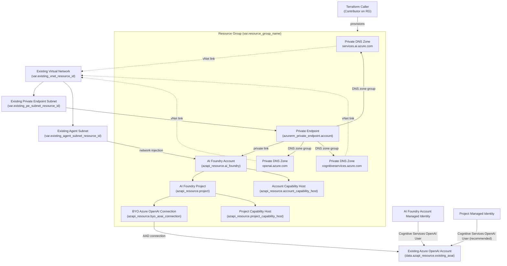

# AI Foundry BYO Azure OpenAI with Existing VNet (Terraform)

This Terraform configuration mirrors the structure of the private networking template while targeting an existing virtual network and private endpoint subnet. It deploys an Azure AI Foundry account that disables public network access, wires the account into the supplied networking resources, and connects the AI Foundry project to a bring-your-own Azure OpenAI account.

## Prerequisites

- Terraform 1.6.0 or later.
- Azure CLI authenticated to the target subscription (`az login`) or another supported `azurerm` authentication flow.
- A resource group where the AI Foundry resources will be created.
- An existing virtual network, a subnet dedicated to private endpoints with network policies disabled, and a separate subnet reserved for AI Foundry agent network injection.
- The resource ID for an existing Azure OpenAI account that will back the BYO connection.

## Configuration

Copy `terraform.tfvars.example` to `terraform.tfvars` (or provide another `-var-file`) and update the inputs:

- `resource_group_name`: Resource group that will host the deployed resources.
- `account_base_name`: Base string used for the AI Foundry account name; Terraform appends a 4-character suffix for uniqueness.
- `location`: Azure region for the deployment. Must be one of the regions enumerated in `variables.tf`.
- `project_name`: Optional explicit project resource name; defaults to `<account-name>-proj` when omitted.
- `project_display_name`, `project_description`: Metadata stored on the project resource.
- `existing_vnet_resource_id`: Resource ID of the virtual network that will be linked to the AI Foundry private DNS zones.
- `existing_pe_subnet_resource_id`: Resource ID of the subnet that hosts the private endpoint. Network policies must already be disabled on this subnet.
- `existing_agent_subnet_resource_id`: Resource ID of the subnet that will be injected into AI Foundry for agent networking.
- `existing_aoai_resource_id`: Resource ID of the Azure OpenAI account that powers the BYO connection.

## Deploy

```bash
terraform init
terraform plan -var-file="terraform.tfvars"
terraform apply -var-file="terraform.tfvars"
```

## Deployed resources

- Azure AI Foundry account (`AIServices`) with a system-assigned managed identity and public network access disabled.
- Private DNS zones for AI Foundry, Azure OpenAI, and Cognitive Services linked to the existing virtual network.
- Private endpoint deployed into the provided subnet and associated DNS zone group.
- AI Foundry project with managed identity, BYO Azure OpenAI connection, and the required capability hosts.
- AI Foundry network injection configured to use the provided agent subnet.

## Resource & Permission Diagram



## Outputs

After `terraform apply`, Terraform emits:

- `account_id`: Resource ID of the AI Foundry account.
- `account_name`: Name of the AI Foundry account.
- `account_endpoint`: Endpoint URI for the AI Foundry account (accessible from the private network).
- `project_name`: Name of the AI Foundry project.
- `project_connection_name`: Resource ID of the BYO Azure OpenAI project connection.

## Cleanup

Run `terraform destroy -var-file="terraform.tfvars"` to delete the resources created by this configuration. The referenced virtual network, subnet, and Azure OpenAI account remain untouched.
