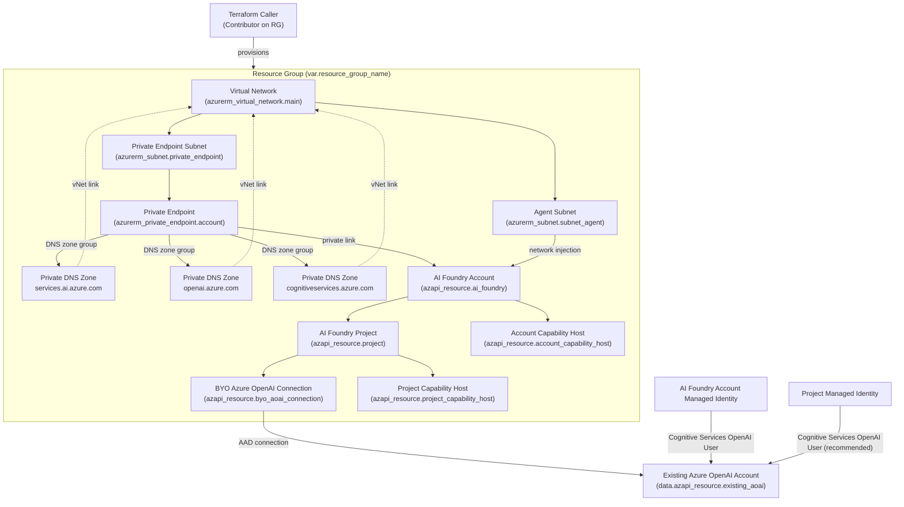

# AI Foundry BYO Azure OpenAI with Private Networking (Terraform)

This Terraform configuration mirrors the Bicep template in `../bicep` by deploying an Azure AI Foundry account locked to private networking and wiring it to an existing Azure OpenAI account. It provisions the networking prerequisites (virtual network, private endpoint, and DNS zones), then creates the AI Foundry project, connection, and capability hosts required to use the BYO Azure OpenAI resource.

## Prerequisites

- Terraform 1.6.0 or later.
- Azure CLI logged in to the target subscription (`az login`) or another supported azurerm authentication method.
- Permissions to create virtual networks, private endpoints, and Cognitive Services resources in the target subscription.
- The resource ID for an existing Azure OpenAI account you plan to connect.

## Configuration

Copy `terraform.tfvars.example` to `terraform.tfvars` (or point to it with `-var-file`) and adjust the inputs:

- `resource_group_name`: Resource group where all deployed resources are created.
- `account_base_name`: Base string used to derive the AI Foundry account name; a 4-character suffix is appended automatically.
- `location`: Azure region for the resources. Must be one of the supported regions listed in `variables.tf`.
- `project_name`: Optional explicit project resource name. Defaults to `<account-name>-proj` when omitted.
- `project_display_name`, `project_description`: Project metadata values.
- `vnet_name`, `pe_subnet_name`: Names assigned to the new virtual network and private endpoint subnet.
- `vnet_address_prefix`, `pe_subnet_prefix`: CIDR prefixes used for the virtual network and subnet. Ensure they do not overlap with peered networks.
- `existing_aoai_resource_id`: Resource ID of the Azure OpenAI account that backs the BYO connection.

## Deploy

```bash
terraform init
terraform plan -var-file="terraform.tfvars"
terraform apply -var-file="terraform.tfvars"
```

## Deployed resources

- Azure AI Foundry account (`AIServices`) with a system-assigned managed identity and public network access disabled.
- Private DNS zones for AI Foundry, Azure OpenAI, and Cognitive Services linked to the new virtual network.
- Virtual network and private endpoint subnet sized per the provided prefixes.
- Private endpoint targeting the AI Foundry account with a DNS zone group referencing the three zones.
- AI Foundry project with a managed identity plus BYO Azure OpenAI connection and matching capability hosts at the account and project scope.

## Resource & Permission Diagram



## Outputs

After `terraform apply`, Terraform emits:

- `account_id`: Resource ID of the AI Foundry account.
- `account_name`: Name of the AI Foundry account.
- `account_endpoint`: Endpoint URI for the account (accessible via private networking).
- `project_name`: Name of the AI Foundry project.
- `project_connection_name`: Resource ID of the BYO Azure OpenAI project connection.

## Cleanup

Run `terraform destroy -var-file="terraform.tfvars"` to delete the infrastructure that this configuration creates. The existing Azure OpenAI account referenced by `existing_aoai_resource_id` is not modified.
