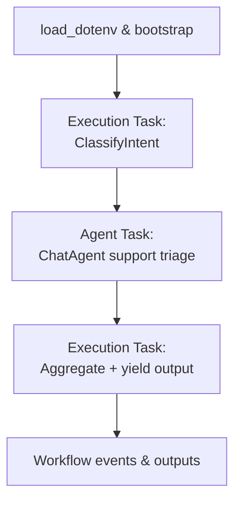

# Agent Framework Task & Workflow Guide

## Purpose
- Capture repeatable guidance for building execution tasks, agent tasks, and orchestrated workflows with Microsoft Agent Framework.
- Emphasize proof-of-concept (POC) patterns that rely exclusively on packages provided by the framework (no ad-hoc orchestration code or third-party runners).
- Highlight environment, structure, and documentation expectations so that prototypes can evolve to production-ready services.

## Environment Preparation
1. **Create a virtual environment** and install preview packages:
   ```bash
   python -m venv .venv
   source .venv/bin/activate  # Windows: .venv\Scripts\activate
   pip install --upgrade pip
   pip install "agent-framework[azure-ai,viz]" --pre
   ```
   The optional extras bring Azure AI integrations and workflow visualization helpers into the runtime used by the POC.

2. **Load configuration from `.env`**. Treat `.env` as the single source for secrets and environment-scoped configuration. Bootstrap every entry point by importing `dotenv.load_dotenv()` before constructing agents or workflows:
   ```python
   from dotenv import load_dotenv

   load_dotenv()  # Must run before importing/instantiating clients or agents
   ```

3. **Document expected variables** in project README files and provide safe development defaults. Common values:
   - `OPENAI_API_KEY`, `OPENAI_CHAT_MODEL_ID`
   - `AZURE_OPENAI_API_KEY`, `AZURE_OPENAI_ENDPOINT`, `AZURE_OPENAI_CHAT_DEPLOYMENT_NAME`, `AZURE_OPENAI_API_VERSION`
   - `AZURE_KEY_VAULT_URI` when demonstrating secret retrieval patterns

4. **Recommended tooling** for linting and formatting follows repository standards: `ruff`, `black`, `mypy`. Scaffold the configuration if absent and call it out as a follow-up item in README notes.

## Execution Tasks
Execution tasks encapsulate discrete units of work to be scheduled inside a workflow graph. The framework offers two primary ergonomics:

- **Subclass `Executor`** and mark asynchronous handlers with `@handler`. This is ideal when you need lifecycle hooks, stateful execution, or custom IDs.
- **Decorate async functions with `@executor`** for lightweight transformations.

```python
from agent_framework import Executor, WorkflowContext, executor, handler
from typing_extensions import Never

class ClassifyIntent(Executor):
    def __init__(self) -> None:
        super().__init__(id="classify_intent")

    @handler
    async def classify(self, text: str, ctx: WorkflowContext[str]) -> None:
        # TODO: replace the placeholder heuristic with an LLM call when hardening
        intent = "support" if "help" in text.lower() else "general"
        await ctx.send_message(intent)

@executor(id="route_to_final")
async def complete(result: dict[str, str], ctx: WorkflowContext[Never, dict[str, str]]) -> None:
    await ctx.yield_output(result)
```

**Key practices**
- Name executors and handlers descriptively; IDs become node labels in observability and visualization tools.
- Use typed `WorkflowContext[T_Out, T_WorkflowOut]` to make message contracts explicit.
- Prefer stateless handlers for POC speed, but document any stateful shortcuts inline as TODOs for production.

## Agent Tasks
Agent tasks wrap LLM-backed capabilities (`ChatAgent`, `AzureChatAgent`, custom `BaseAgent` subclasses) so that workflows can offload planning or creative reasoning. A minimal agent task typically:

1. Instantiates a chat client (`OpenAIChatClient`, `AzureOpenAIChatClient`, etc.).
2. Defines instruction prompts or system messages.
3. Exposes a `run` coroutine that accepts messages or text.

```python
from agent_framework import ChatAgent, Executor, WorkflowContext, handler
from agent_framework.openai import OpenAIChatClient

support_agent = ChatAgent(
    id="support_triage_agent",
    chat_client=OpenAIChatClient(),
    instructions="""
    You are the first responder for triaging customer issues.
    - Keep answers concise.
    - Flag sensitive data sightings with `SENSITIVE: <details>`.
    """,
)

async def triage_issue(ticket_text: str) -> str:
    response = await support_agent.run(ticket_text)
    return response.messages[0].text


class SupportResponder(Executor):
    """Wrap the agent so it can participate as a workflow executor."""

    def __init__(self, agent: ChatAgent) -> None:
        super().__init__(id="support_responder")
        self.agent = agent

    @handler
    async def handle(self, intent: str, ctx: WorkflowContext[dict[str, str]]) -> None:
        """Run the agent with context derived from upstream intent and emit a structured payload."""
        response = await self.agent.run(
            f"Customer intent: {intent}. Draft a short reply acknowledging the issue and next steps.")
        payload = {"intent": intent, "reply": response.messages[0].text}
        await ctx.send_message(payload)
```

**When to bridge agents into workflows**
- Use `WorkflowAgent` to expose entire workflows as callable agents.
- Use `ConcurrentBuilder` or `SequentialBuilder` helpers to fan out to multiple agent tasks while maintaining message context.
- Record TODO comments near prompt strings describing future grounding strategies (vector search, tool calling, etc.).

## Orchestrating Workflows
Workflows define the directed graph connecting execution and agent tasks. The `WorkflowBuilder` API supports sequential, branching, and concurrent topologies without custom orchestration code.

```python
from agent_framework import WorkflowBuilder

classifier = ClassifyIntent()
responder = SupportResponder(support_agent)

workflow = (
    WorkflowBuilder()
    .set_start_executor(classifier)
    .add_edge(classifier, responder)
    .add_edge(responder, complete)
    .build()
)
```

**Workflow patterns to leverage**
- `SequentialBuilder` for linear pipelines with shared conversation state.
- `ConcurrentBuilder` for fan-out/fan-in orchestrations and aggregators.
- Checkpointing (`workflow.enable_checkpoints`) when human-in-the-loop or retries are required.
- Visualization (`workflow.to_mermaid()` or `workflow.export_viz`) to embed diagrams in documentation.

## POC Blueprint Using Agent Framework Exclusively
Follow the steps below to ship a cohesive POC:

1. **Scaffold project layout**
   ```text
   your-poc/
   ├─ README.md
   ├─ .env.example
   ├─ src/
   │  ├─ __init__.py
   │  ├─ main.py            # entry point: loads dotenv, builds workflow, runs CLI or API
   │  ├─ tasks.py           # execution task definitions
   │  ├─ agents.py          # LLM agent definitions
   │  └─ workflow.py        # workflow builder and helpers
   └─ tests/
      └─ test_workflow.py
   ```

2. **Populate `.env.example`** with mock-safe defaults (e.g., `AZURE_OPENAI_ENDPOINT="https://contoso.openai.azure.com"`). Copy to `.env` locally.

3. **Bootstrap `main.py`**
   ```python
   from dotenv import load_dotenv
   load_dotenv()

   import asyncio
   from src.workflow import build_workflow

   async def run_demo() -> None:
       workflow = build_workflow()
       events = await workflow.run("Summarize ticket #123 about login failures")
       print(events.get_outputs())

   if __name__ == "__main__":
       asyncio.run(run_demo())
   ```

4. **Implement `build_workflow`** so it stitches together execution and agent tasks defined in `tasks.py` and `agents.py`. Reuse patterns from `samples/getting_started/workflows`.
   - Fetch secrets via Azure Key Vault in the entry-point (e.g., `SecretClient` + `DefaultAzureCredential`) and mock these calls in local tests to keep credentials off developer machines.

5. **Add smoke tests** using `pytest` or `unittest` that call `workflow.run()` with mocked chat clients (e.g., stub `support_agent.chat_client` to return deterministic text). Document missing integration tests in README.

6. **Document run & test commands** in `README.md`, including `pytest`, lint steps, and any optional visualization exports.

7. **Use Agent Framework observability hooks** (logging, event streams) to capture telemetry; describe how to pivot toward Azure Monitor or Application Insights for production.

## Mermaid Overview


## Testing, Deployment, and Next Steps
- **Smoke testing**: run `pytest` or a lightweight async script to validate node wiring. Capture workflow outputs and ensure run state is `WorkflowRunState.COMPLETED`.
- **Deployment-ready scripts**: supply CLI or FastAPI entry points that only depend on Agent Framework primitives. For Azure delivery, add Bicep/Terraform skeletons and `az deployment` commands referencing the workflow runner.
- **Production hardening TODOs**: document required work for VNet integration, scaling rules, secret rotation via Azure Key Vault, rich monitoring, and CI/CD pipelines. Place these as comments/TODOs near temporary shortcuts.

## References
- Core README: `python/README.md`
- Workflow samples: `samples/getting_started/workflows`
- Agent samples: `samples/getting_started/agents`
- Visualization helpers: `packages/core/agent_framework/_workflows/_viz.py`
