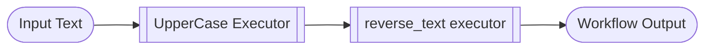
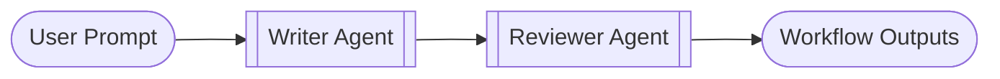
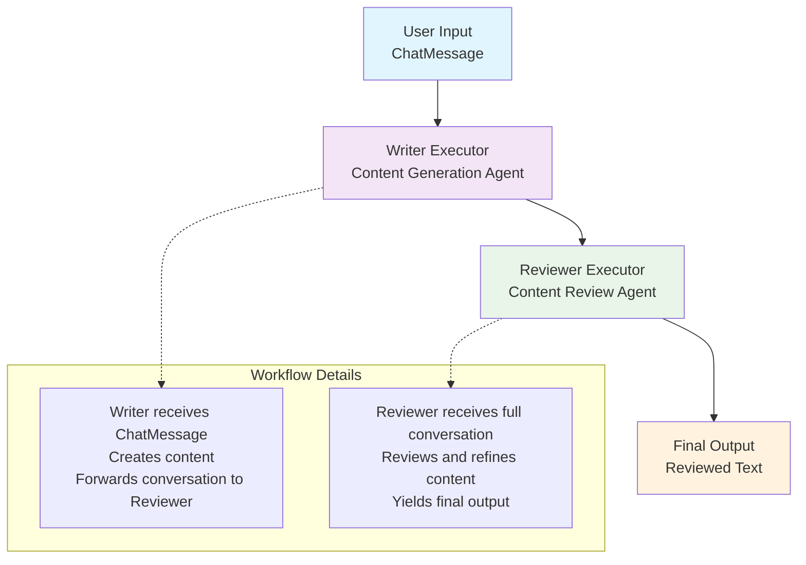

# Start Here Notebooks

Introductory walkthroughs that build up the Agent Framework workflow basics step by step.

## step1_executors_and_edges.ipynb

**Summary:** Connect two workflow executors: one uppercases text, the other reverses it and yields the final output. Along the way you learn how handlers work and how `WorkflowBuilder` wires nodes together. Key ingredients: `Executor` subclasses expose async handlers decorated with `@handler`; `@executor` turns a standalone function into a node; `WorkflowBuilder` creates a graph and its `run()` call collects yielded outputs.



## step2_agents_in_a_workflow.ipynb

**Summary:** A Writer agent drafts a slogan, then a Reviewer agent critiques it. The workflow simply connects the two and prints what each agent says along with the final output list. Key ingredients: Azure-hosted chat agents created via `AzureOpenAIChatClient`; `WorkflowBuilder` wiring without custom executors-agents themselves can act as nodes; Event iteration over `AgentRunEvent` objects to display intermediate agent messages.



## step3_streaming.ipynb

**Summary:** A Writer agent generates content, a Reviewer agent finalizes it, and `run_stream()` lets you watch every workflow event as it happens. Key ingredients: Custom executor classes that wrap `ChatAgent` instances; Typed `WorkflowContext` usage for both sending messages and yielding outputs; Streaming event loop that prints status transitions, outputs, and failures.



This diagram shows the flow created by:
```python
workflow = WorkflowBuilder().set_start_executor(writer).add_edge(writer, reviewer).build()
```
