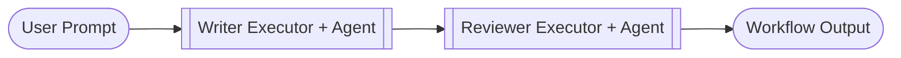

# Agents Notebooks

Agent-centric scenarios that highlight how Azure OpenAI agents plug into workflows and collaborate.

## azure_ai_agents_streaming.ipynb

**Summary:** Imagine two coworkers: a Writer who drafts marketing slogans and a Reviewer who reacts in real time. This workflow wires both Azure AI agents together and streams their thoughts token by token so you can watch the creative back-and-forth live. Key ingredients: AzureAIAgentClient - spins up hosted Azure AI agents with instructions; AsyncExitStack - keeps async context managers tidy and closes everything once we're done; WorkflowBuilder.add_agent - drops ready-to-use agent executors into the workflow graph; run_stream() + AgentRunUpdateEvent - streams incremental text chunks you can print as they arrive; WorkflowOutputEvent - emits the reviewer's final verdict as the workflow output.

## azure_chat_agents_streaming.ipynb

**Summary:** A Writer agent drafts a slogan, the Reviewer agent critiques it, and `run_stream()` lets you watch both agents emit token-by-token updates before the final decision. Key ingredients: `WorkflowBuilder.add_agent()` turns chat agents into workflow nodes without writing custom executors; Streaming yields `AgentRunUpdateEvent` deltas so you can print partial generations; Marking the Reviewer with `output_response=True` surfaces its final reply as a workflow output.

## custom_agent_executors.ipynb

**Summary:** Wrap two Azure OpenAI agents inside custom executors: the Writer produces messages, the Reviewer critiques them, and the final text becomes the workflow output. Key ingredients: `Executor` subclasses own an agent client and expose typed handlers; `WorkflowContext` carries both downstream messages and workflow outputs; The fluent `WorkflowBuilder` stitches the Writer and Reviewer into a tiny pipeline.

## workflow_as_agent_human_in_the_loop.ipynb

**Summary:** A workflow agent handles most reviews automatically. When the Reviewer executor lacks confidence, it emits a human review request. Your app receives a structured function call, collects the manager's decision, and feeds it back so the Worker can continue. Key ingredients: `WorkflowAgent` wraps a workflow so you can call it like any other chat agent; A `Worker` executor drafts answers, and a reviewer decides whether to escalate; `RequestInfoExecutor` pauses the workflow and surfaces a structured function call for the human; The driver code inspects messages for `WorkflowAgent.REQUEST_INFO_FUNCTION_NAME` and replies with a `FunctionResultContent`.

## workflow_as_agent_reflection_pattern.ipynb

**Summary:** A workflow alternates between a Worker that drafts answers and a Reviewer that either approves them or asks for revisions. When approved, the Worker streams the response back to the caller via `AgentRunUpdateEvent`. Key ingredients: `WorkflowAgent` wraps the workflow so external callers interact with it like a chat agent; `ReviewRequest` / `ReviewResponse` dataclasses carry structured feedback; `AgentRunUpdateEvent` streams approved outputs back to the caller.

