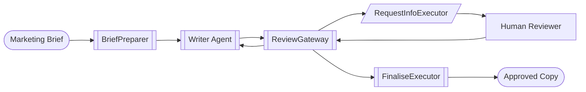
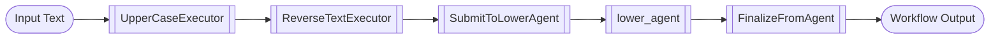
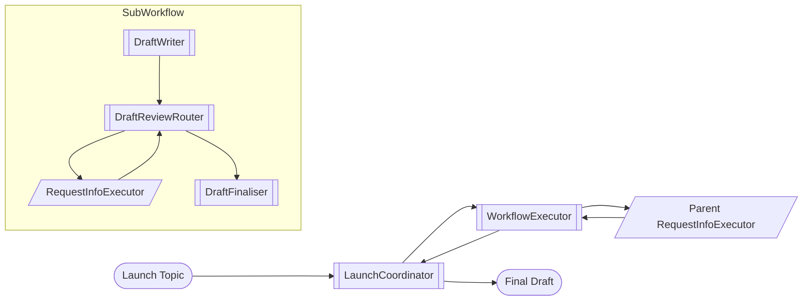

# Checkpoint Notebooks

Examples that show how to pause, resume, and branch workflows with checkpoints.

## checkpoint_with_human_in_the_loop.ipynb

**Summary:** Think of a relay race between an AI copywriter and a human reviewer. The workflow drafts release notes, pauses for human approval, and can be stopped and resumed later because every superstep is checkpointed. Key ingredients: `WorkflowBuilder` wires a tiny graph: prepare brief -> writer -> review gateway -> human -> finalise; `RequestInfoExecutor` pauses the run until a human provides guidance; `FileCheckpointStorage` keeps JSON snapshots so a later process can resume; Helper utilities print checkpoint summaries and replay events for humans.

## checkpoint_with_resume.ipynb

**Summary:** Picture a factory line that capitalises text, reverses it, hands it to an AI to lowercase again, and saves its progress after every station. If the factory stops, you can restart from any saved checkpoint and finish the job. Key ingredients: Executors that transform text (`UpperCaseExecutor`, `ReverseTextExecutor`, `FinalizeFromAgent`); `SubmitToLowerAgent` bridges into an Azure AI agent for the lowercase step; `FileCheckpointStorage` persists workflow state between runs; Utility helpers list checkpoints and let you resume from whichever one you want.

## sub_workflow_checkpoint.ipynb

**Summary:** A parent workflow delegates drafting work to a sub-workflow. The sub-workflow pauses for human review, the parent persists checkpoints, and later you can resume with the human decision already supplied. Key ingredients: Data classes describe the messages passed between parent, sub-workflow, and human reviewers; The sub-workflow uses `RequestInfoExecutor` to surface human approval; The parent workflow wraps the sub-workflow with `WorkflowExecutor` and writes checkpoints; Resume logic reads the pending request from storage and injects the approval automatically.

