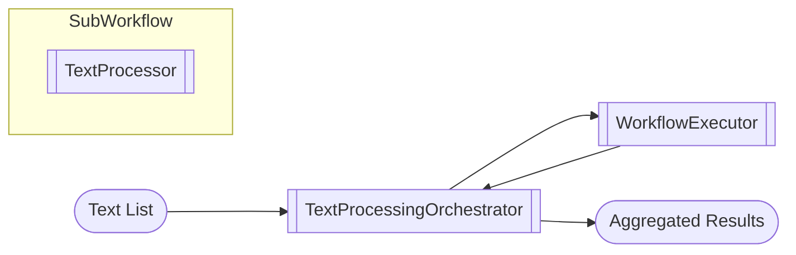
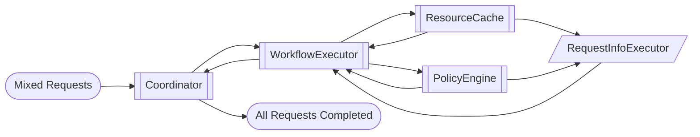
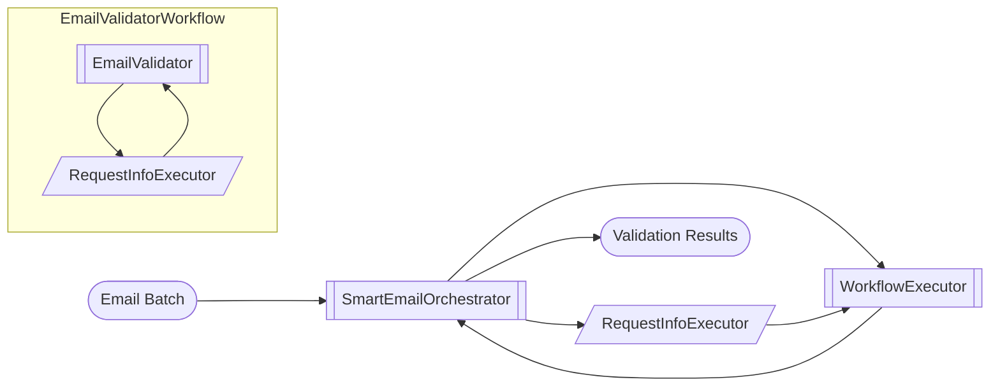

# Composition Notebooks

Sub-workflow composition patterns for assembling larger orchestrations from smaller pieces.

## sub_workflow_basics.ipynb

**Summary:** A parent workflow fan-outs text snippets to a sub-workflow that counts words and characters. Once every sub-workflow finishes, the parent collates the results and prints a summary. Key ingredients: `WorkflowExecutor` lets the parent treat another workflow like an executor node; `TextProcessor` runs in the sub-workflow and yields `TextProcessingResult` objects; The orchestrator collects results, fires a custom `AllTasksCompleted` event, and prints a report.

## sub_workflow_parallel_requests.ipynb

**Summary:** A sub-workflow emits both resource allocation requests and policy checks. The parent workflow routes each message type to a specialized interceptor (cache vs. policy engine) and only hands misses off to an external service. Key ingredients: Typed `RequestInfoMessage` subclasses (`ResourceRequest`, `PolicyCheckRequest`) enable type-safe routing; Interceptors use `@handler` methods with those types to react only to relevant messages; `WorkflowExecutor` embeds the resource requester workflow inside the parent graph; External requests are simulated via `RequestInfoExecutor` for cache misses or policy escalations.

## sub_workflow_request_interception.ipynb

**Summary:** A parent workflow validates emails by delegating to a sub-workflow. It intercepts domain checks for known domains and forwards unknown ones to an external service, then routes responses back to the originating sub-workflow run. Key ingredients: `WorkflowExecutor` allows the parent to treat an entire workflow like one executor node; `RequestInfoMessage` subclasses carry structured requests (`DomainCheckRequest`); Correlated `RequestResponse` objects ensure results reach the right email validation run; `RequestInfoExecutor` simulates an external service for unknown domains.

