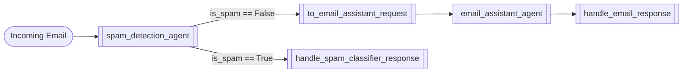

# Control Flow Notebooks

Examples focused on conditional edges and routing decisions inside a workflow.

## edge_condition.ipynb

**Summary:** Imagine an office mailroom assistant who checks each email, decides whether it's spam, and either throws it away or drafts a friendly reply for you. The script builds exactly that mailroom as an Agent Framework workflow powered by Azure OpenAI agents. We will walk through the cast of characters, the decision logic, and the workflow wiring so you can see how the pieces click together, no matter your background. Key ingredients: Agents & Executors - Mini workers powered by Azure OpenAI. Executors wrap them so the workflow engine can run them; WorkflowBuilder - LEGO blocks that connect executors and describe how messages move; Structured Outputs - Pydantic models (`DetectionResult`, `EmailResponse`) guarantee the AI sends well-formed JSON instead of messy text; Edge Conditions - Tiny yes/no checks that decide which path the message takes next; Azure Identity - `AzureCliCredential` reuses your `az login` so you do not hard-code secrets.

