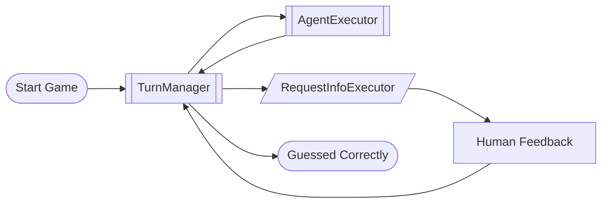

# Human In The Loop Notebooks

Workflows that invite human input while the automation runs.

## guessing_game_with_human_input.ipynb

**Summary:** An Azure AI agent plays a number guessing game. After each guess the workflow pauses for a human to say higher, lower, or correct. Once the human confirms the answer, the workflow finishes. Key ingredients: `RequestInfoExecutor` pauses execution to collect human input and resumes when you supply a response; `TurnManager` orchestrates the back-and-forth among agent, human, and workflow; `AgentExecutor` runs an Azure-hosted agent that always returns JSON (`{"guess": <int>}`) using `response_format`; Streaming APIs (`run_stream`, `send_responses_streaming`) keep the workflow responsive while you type answers.

