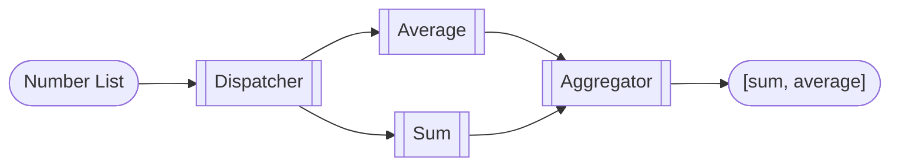
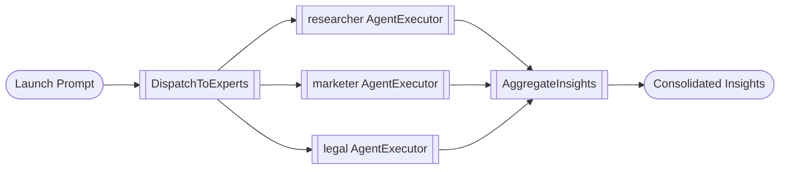
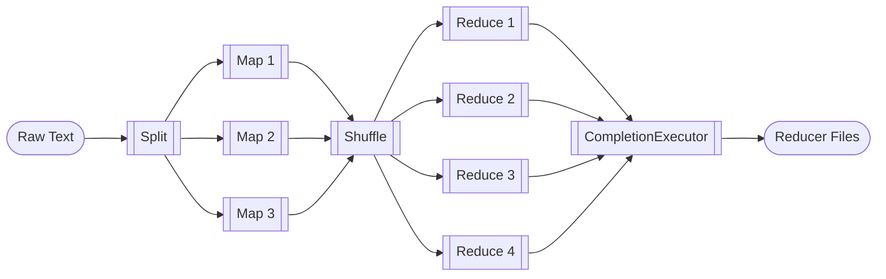

# Parallelism Notebooks

Parallel processing patterns that fan work out, merge results, and visualize outcomes.

## aggregate_results_of_different_types.ipynb

**Summary:** A dispatcher fans out a list of numbers to two workers (Average and Sum). Their outputs are fanned back in by an Aggregator that collects multiple result types in a single list. Key ingredients: `WorkflowBuilder.add_fan_out_edges` and `.add_fan_in_edges` express parallel branches and joins; Executors send messages with typed `WorkflowContext`; Streaming run emits `WorkflowOutputEvent` when the fan-in node yields results.

## fan_out_fan_in_edges.ipynb

**Summary:** One dispatcher fans out a marketing brief to researcher, marketer, and legal agents. Their responses are fanned back in and aggregated into a single report. Key ingredients: Agent executors created by `AzureOpenAIChatClient`; Fan-out edges from the dispatcher to multiple experts; Fan-in edges into an aggregator that merges structured agent responses.

## map_reduce_and_visualization.ipynb

**Summary:** We split a long document into chunks, map over the tokens, shuffle intermediate results to reducers, and finally aggregate word counts. Along the way we persist intermediate files and show how to visualize the workflow graph. Key ingredients: Fan-out/fan-in edges express the classic map-reduce stages; Shared state lets each mapper read its token range without copying large payloads; `WorkflowViz` can emit Mermaid/DiGraph strings or export an SVG when the viz extra is installed.

