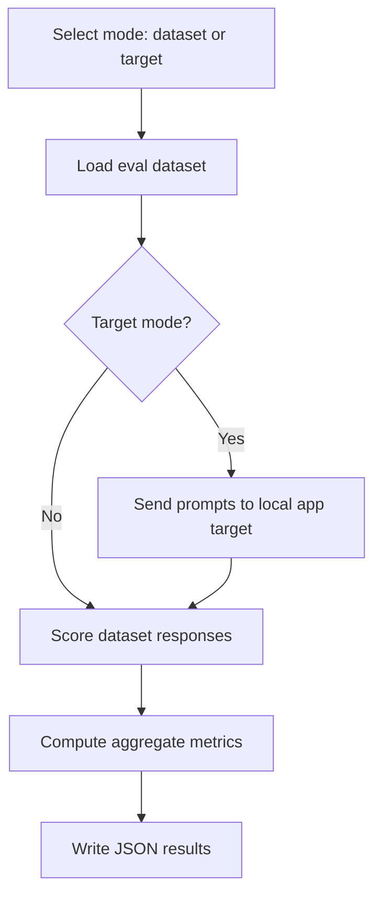

# Local Content Safety Harms Evaluation

Run a local content-safety evaluation with the Azure AI Evaluation SDK (preview). This sample evaluates query/response pairs for safety risks (violence, self-harm, sexual content, hate/unfairness) and can optionally send queries to a local app target before scoring.



## Setup

1. Create and activate a virtual environment.
2. Install dependencies.
3. Copy `.env.example` to `.env` and fill in Foundry project details.

```bash
python -m venv .venv
source .venv/bin/activate  # Windows: .venv\Scripts\activate
pip install --upgrade pip
pip install -r requirements.txt
cp .env.example .env
```

Required environment variables (use either option):

- `AZURE_AI_PROJECT` (project endpoint)
- or all of: `AZURE_SUBSCRIPTION_ID`, `AZURE_RESOURCE_GROUP`, `AZURE_PROJECT_NAME`

Optional:

- `AZURE_USE_INTERACTIVE_CREDENTIAL=true` to use browser auth locally.

## Run the local eval

Evaluate the bundled dataset:

```bash
python src/local_content_safety_eval.py \
  --mode dataset \
  --data data/content_safety_eval.jsonl \
  --output outputs/content_safety_results.json
```

Evaluate a local app target (sample target included in `src/sample_app_target.py`):

```bash
python src/local_content_safety_eval.py \
  --mode target \
  --data data/content_safety_eval.jsonl \
  --target src.sample_app_target:sample_target \
  --output outputs/content_safety_results.json
```

## What you get

- Aggregate metrics printed to the console.
- Full JSON results saved in `outputs/content_safety_results.json`.
- If configured with a Foundry project, a `studio_url` is printed for tracking results.
