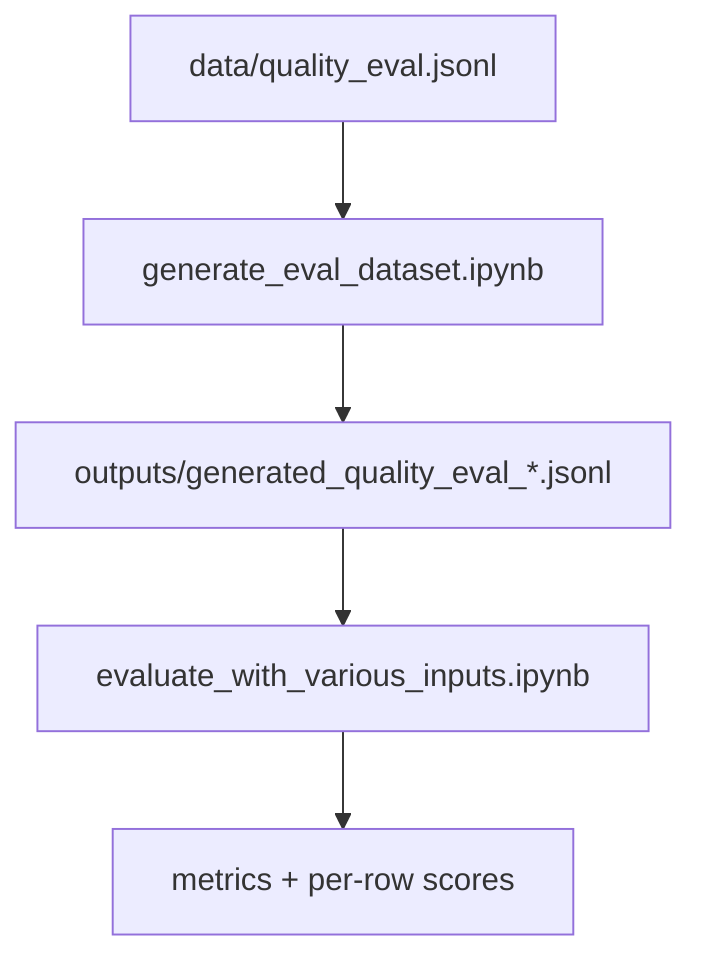

# Local Quality Evals

Run local quality evaluations with the Azure AI Evaluation SDK (preview). This sample uses notebooks to generate query/response datasets and evaluate them offline with built-in evaluators.

## Setup

1. Create and activate a virtual environment.
2. Install dependencies.
3. Copy `.env.example` to `.env` and fill in Azure OpenAI details.

```bash
python -m venv .venv
source .venv/bin/activate  # Windows: .venv\Scripts\activate
pip install --upgrade pip
pip install -r requirements.txt
cp .env.example .env
```

Required environment variables (for dataset generation):

- `AZURE_OPENAI_ENDPOINT` (base URL for your Azure OpenAI deployment endpoint)
- `AZURE_OPENAI_DEPLOYMENT` (deployment name, defaults to `gpt-5-nano` in the notebook)
- `AZURE_TENANT_ID` (tenant used by `DefaultAzureCredential`)

## Data

- `data/quality_eval.jsonl` stores input records. Each line is JSON with a required `query` and optional `ground_truth`.
- `data/seed_prompt.json` provides the system prompt used to generate responses.

Example input line:

```json
{"query":"Option 2 please.","ground_truth":"is_rpa_flow_related=True; route_to='current'; requires_prompt=False"}
```

## Notebooks

- `notebooks/generate_eval_dataset.ipynb` reads `data/quality_eval.jsonl`, calls Azure OpenAI, and writes `outputs/generated_quality_eval_<timestamp>.jsonl` with `query`, `response`, `ground_truth`, and `system_prompt`.
- `notebooks/evaluate_with_various_inputs.ipynb` runs an offline `RougeScoreEvaluator` over a JSONL dataset. The sample maps `ground_truth` to the response column for a self-comparison demo—adjust the mapping if you provide real ground-truth text.

## Flow



## What you get

- Aggregate metrics printed to the console.
- Full evaluation results returned from `evaluate` (and can be exported if desired).
