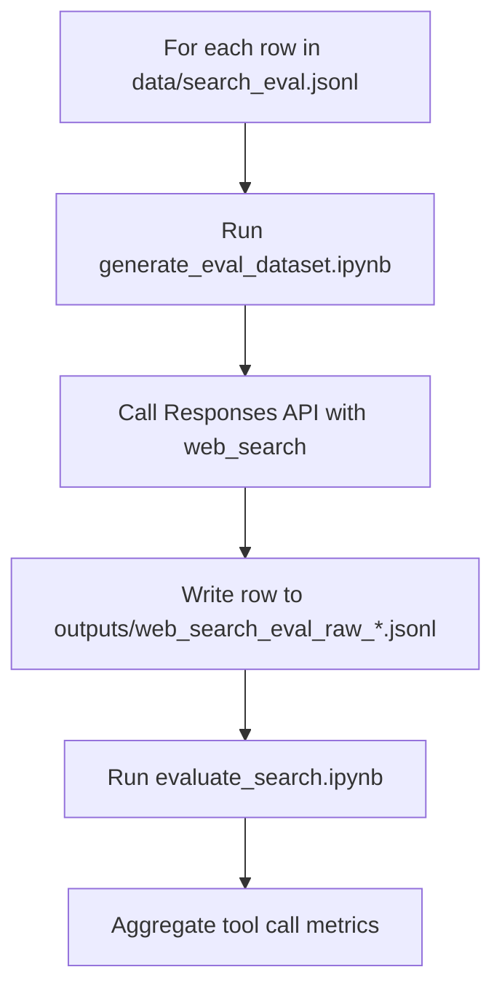
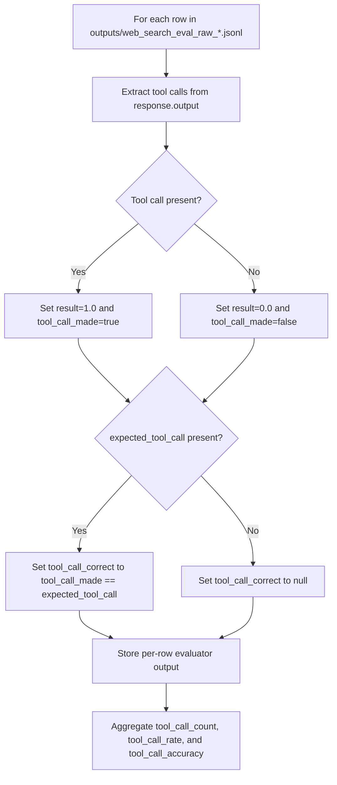

# Web Search Evals

Run local web search evaluations with the Responses API and the `web_search` tool. The notebooks generate a JSONL log of response payloads and then evaluate tool usage based on the tool call metadata in each response.

## Setup

1. Create and activate a virtual environment.
2. Install dependencies.
3. Copy `.env.example` to `.env` and fill in Azure OpenAI details.

```bash
python -m venv .venv
source .venv/bin/activate  # Windows: .venv\Scripts\activate
pip install --upgrade pip
pip install -r requirements.txt
cp .env.example .env
```

Required environment variables (for dataset generation):

- `AZURE_OPENAI_BASE_URL` (or `AZURE_OPENAI_API_BASE` / `AZURE_EXISTING_AIPROJECT_ENDPOINT`)
- `AZURE_OPENAI_MODEL` (or `AZURE_OPENAI_DEPLOYMENT`)

Authentication is handled with `DefaultAzureCredential` + `get_bearer_token_provider` in the notebook. Run `az login` locally (or use managed identity in Azure) before execution.

## Data

- `data/search_eval.jsonl` stores input records. Each line is JSON with a required `query` and optional `id` and `test_case_description` fields.

Example input line:

```json
{"query":"Latest NVIDIA GPU announcements","id":"search_001","test_case_description":"Should trigger web search.","expected_tool_call":true}
```

## Notebooks

- `notebooks/generate_eval_dataset.ipynb` reads `data/search_eval.jsonl`, calls the Responses API with `web_search`, and writes `outputs/web_search_eval_raw_<timestamp>.jsonl` with the raw response payloads.
- `notebooks/evaluate_search.ipynb` uses the Azure AI Evaluation SDK to score tool-call usage, and reports tool-call rate plus accuracy when `expected_tool_call` is present.
- `notebooks/evaluate_with_various_inputs.ipynb` parses tool call metadata from the raw JSONL and summarizes web search usage rates (lightweight, no SDK dependency).

## Flow



## Per-text evaluator flow



## What you get

- Tool call accuracy metrics (when `expected_tool_call` is provided).
- Tool call usage rates for the evaluation dataset.
- Per-row tool call metadata for deeper inspection.
