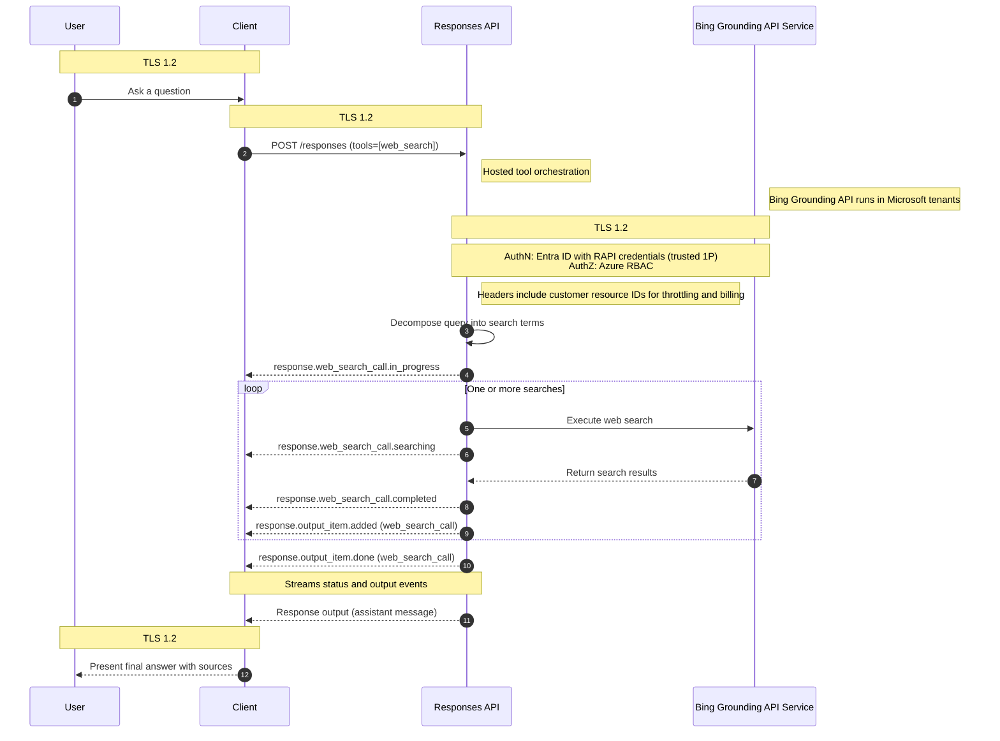

```mermaid
sequenceDiagram
    autonumber
    participant User
    participant Client
    participant API as Responses API
    participant Bing as Bing Grounding API Service

    Note over User,Client: TLS 1.2
    User->>Client: Ask a question
    Note over Client,API: TLS 1.2
    Client->>API: POST /responses (tools=[web_search])
    Note right of API: Hosted tool orchestration
    Note right of Bing: Bing Grounding API runs in Microsoft tenants
        Note over API,Bing: TLS 1.2
    Note over API,Bing: AuthN: Entra ID with RAPI credentials (trusted 1P)<br/>AuthZ: Azure RBAC
    Note left of Bing: Headers include customer resource IDs for throttling and billing
    API->>API: Decompose query into search terms
    API-->>Client: response.web_search_call.in_progress

    loop One or more searches
        API->>Bing: Execute web search
        API-->>Client: response.web_search_call.searching
        Bing-->>API: Return search results
        API-->>Client: response.web_search_call.completed
        API-->>Client: response.output_item.added (web_search_call)
    end
    API-->>Client: response.output_item.done (web_search_call)
    Note over API,Client: Streams status and output events
    API-->>Client: Response output (assistant message)
    Note over User,Client: TLS 1.2
    Client-->>User: Present final answer with sources
```
