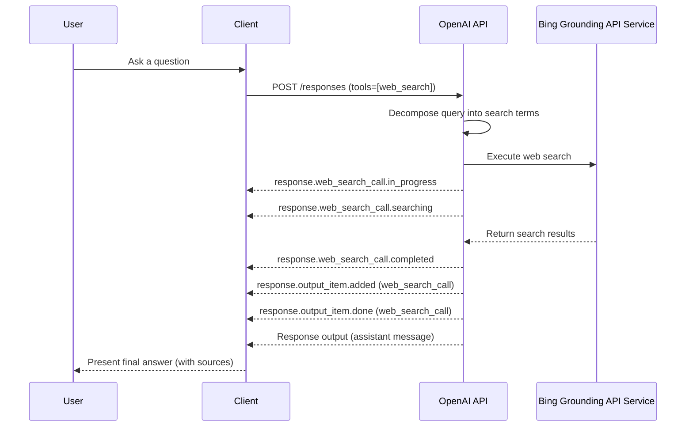

# Websearch tool

Methods:

- <code title="post /responses">client.responses.<a href="./src/openai/resources/responses/responses.py">create</a>(\*\*<a href="src/openai/types/responses/response_create_params.py">params</a>) -> <a href="./src/openai/types/responses/response.py">Response</a></code>
- <code title="get /responses/{response_id}">client.responses.<a href="./src/openai/resources/responses/responses.py">retrieve</a>(response_id, \*\*<a href="src/openai/types/responses/response_retrieve_params.py">params</a>) -> <a href="./src/openai/types/responses/response.py">Response</a></code>
- <code title="delete /responses/{response_id}">client.responses.<a href="./src/openai/resources/responses/responses.py">delete</a>(response_id) -> None</code>
- <code title="post /responses/{response_id}/cancel">client.responses.<a href="./src/openai/resources/responses/responses.py">cancel</a>(response_id) -> <a href="./src/openai/types/responses/response.py">Response</a></code>
- <code title="post /responses/compact">client.responses.<a href="./src/openai/resources/responses/responses.py">compact</a>(\*\*<a href="src/openai/types/responses/response_compact_params.py">params</a>) -> <a href="./src/openai/types/responses/compacted_response.py">CompactedResponse</a></code>

## Web search tool

The `web_search` tool is a hosted tool for the Responses API that lets the model search the public web and incorporate results into the response. When enabled, the model decides if and when to call the tool; the OpenAI server runs the search and returns the results without requiring a separate tool-output submission from your client.

### Enable web search

```python
response = client.responses.create(
    model="gpt-4.1",
    input="Summarize the latest updates to Python packaging standards.",
    tools=[{"type": "web_search"}],
)
```

### Tool configuration

Use `tools` entries of type `web_search` (or `web_search_2025_08_26` for the versioned release). Optional configuration fields are:

- `search_context_size`: `low`, `medium`, or `high` (default `medium`).
- `filters.allowed_domains`: allowlist of domains and subdomains.
- `user_location`: approximate location used to localize results.

```python
response = client.responses.create(
    model="gpt-4.1",
    input="What are the top headlines in local transit?",
    tools=[
        {
            "type": "web_search",
            "search_context_size": "high",
            "filters": {"allowed_domains": ["sf.gov", "sfgate.com"]},
            "user_location": {
                "type": "approximate",
                "city": "San Francisco",
                "region": "California",
                "country": "US",
                "timezone": "America/Los_Angeles",
            },
        }
    ],
)
```

### Output shape

When the model calls the tool, the response includes a `web_search_call` output item (type `ResponseFunctionWebSearch`) with the tool call status and action details. The `action` object describes how the model navigated the web (`search`, `open_page`, or `find_in_page`).

```python
for item in response.output:
    if item.type == "web_search_call":
        print(item.id, item.status, item.action)
```

To receive additional web search data, use `include`:

```python
response = client.responses.create(
    model="gpt-4.1",
    input="What changed in the latest Rust release?",
    tools=[{"type": "web_search"}],
    include=["web_search_call.action.sources", "web_search_call.results"],
)
```

`web_search_call.action.sources` adds the source URLs used for the search action, and `web_search_call.results` includes the raw search results payload when available.

### Streaming events

When `stream=True`, the server emits progress events while the tool runs, plus output-item events when the `web_search_call` is finalized. Relevant `ResponseStreamEvent` types include:

- `response.web_search_call.in_progress`
- `response.web_search_call.searching`
- `response.web_search_call.completed`
- `response.output_item.added` (item type `web_search_call`)
- `response.output_item.done` (item type `web_search_call`)

Each event includes the `item_id`, `output_index`, and a `sequence_number` that you can correlate with the `web_search_call` output item and its completion status.

### User ↔ client ↔ server flow

```text
User -> Client: Ask a question
Client -> OpenAI API: POST /responses (tools=[web_search])
OpenAI API -> OpenAI API: Decompose query into search terms
OpenAI API -> OpenAI API: Execute web search
OpenAI API -> Client: Stream web_search_call events + response output
Client -> User: Present final answer (optionally with sources)
```



## InputItems

Types:

```python
from openai.types.responses import ResponseItemList
```

Methods:

- <code title="get /responses/{response_id}/input_items">client.responses.input_items.<a href="./src/openai/resources/responses/input_items.py">list</a>(response_id, \*\*<a href="src/openai/types/responses/input_item_list_params.py">params</a>) -> <a href="./src/openai/types/responses/response_item.py">SyncCursorPage[ResponseItem]</a></code>

## InputTokens

Types:

```python
from openai.types.responses import InputTokenCountResponse
```

Methods:

- <code title="post /responses/input_tokens">client.responses.input_tokens.<a href="./src/openai/resources/responses/input_tokens.py">count</a>(\*\*<a href="src/openai/types/responses/input_token_count_params.py">params</a>) -> <a href="./src/openai/types/responses/input_token_count_response.py">InputTokenCountResponse</a></code>
